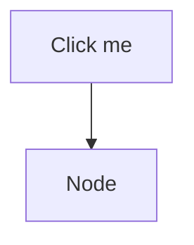
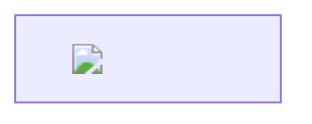
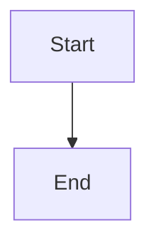

# S6 regression fixture — malicious content, real file-open path

Raw HTML directly in the body (must render as escaped text, never execute):

## Mermaid click-to-JavaScript (a real, historically known Mermaid exploit class)

## Mermaid node label attempting an HTML onerror image

## A normal, legitimate diagram (must still render correctly)

