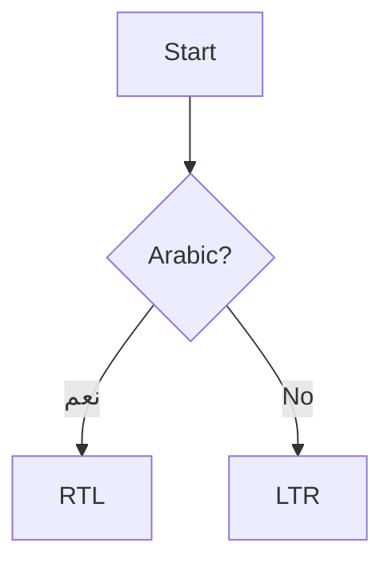

# Waraq verification sample

## مقدمة بالعربية

هذا نص عربي طويل يختبر الاتجاه التلقائي للفقرات، ويحتوي على كلمة English في المنتصف وأرقام 123 أيضاً.

## English section

This paragraph is plain English, to confirm the two directions sit correctly next to each other.

## Task list

- [x] Render GitHub-flavored tables
- [ ] Render Mermaid diagrams
- [x] Render KaTeX math

## Table

| Feature | Status |
| --- | --- |
| RTL/LTR per paragraph | ✅ |
| Mermaid | ✅ |
| Math | ✅ |

## Math

Inline: $E = mc^2$

Block:

$$
\int_0^1 x^2\,dx = \frac{1}{3}
$$

## Diagram



## Code

```js
function hello() {
  return "hello";
}
```
